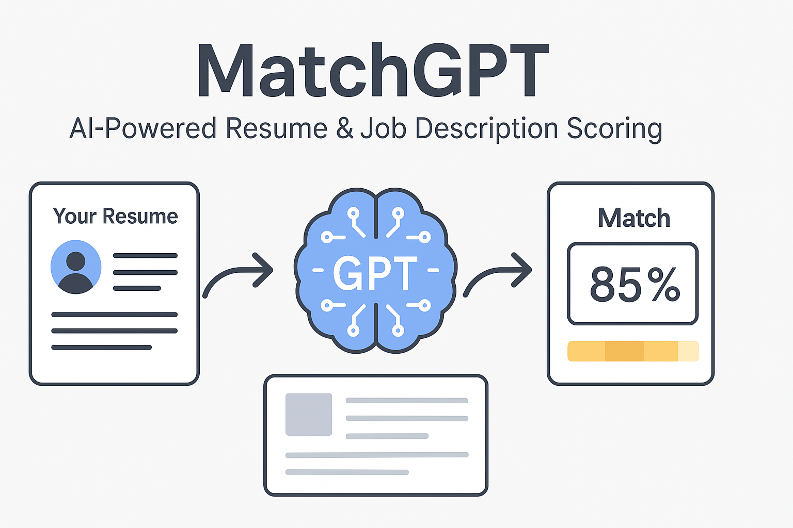

<!-- Hero Banner -->
<p align="center">
  
</p>

<h1 align="center">MatchGPT 💼📊</h1>
<h3 align="center">AI-Powered Resume & Job Description Scorer</h3>

<p align="center">
  ✨ Score how well a resume fits a job description using GPT-powered analysis and structured insights.
</p>

---

## 🚀 About

**MatchGPT** is an open-source tool that uses LLMs to assess how well a candidate's resume matches a job description — giving back structured scores, fit summaries, and improvement suggestions.

Whether you're a job seeker, recruiter, or building hiring tools, MatchGPT helps you **automate alignment insights** using explainable AI.

---

## 🎥 Demo

> 🔄 Replace the GIF below with a short screen recording or animated walkthrough of MatchGPT in action.

<p align="center">
  
</p>

---

## ✨ Features

| Feature                          | Description                                                     |
| -------------------------------- | --------------------------------------------------------------- |
| ✅ **GPT Scoring Engine**        | Uses OpenAI to evaluate resume-to-JD fit with structured rubric |
| 📄 **Natural Language Feedback** | Explains match gaps, missing keywords, and strengths            |
| 📊 **Structured Output**         | Outputs JSON score, strengths, gaps, and suggestions            |
| 🔍 **RAG-Compatible**            | Easily extendable to include knowledge base or skill ontology   |
| ⚙️ **Modular Backend**           | Built with Python (FastAPI/Flask), easily testable and scalable |
| 🌐 **React Frontend**            | Clean UI for uploading files and displaying match results       |

---

## 🛠 How It Works

<p align="center">
  
</p>

> 💡 _Suggestion for diagram:_
>
> - Resume Upload 📝
> - Job Description 📄
> - ➡️ Passed to GPT with a custom prompt
> - ➡️ Returned: Score (0–100), Gaps, Suggestions
> - ➡️ Displayed in the UI

---

## 🧱 Tech Stack

| Layer               | Tech                        |
| ------------------- | --------------------------- |
| **Frontend**        | React / Next.js             |
| **Backend**         | Python + FastAPI (or Flask) |
| **AI**              | OpenAI GPT (or local LLMs)  |
| **Storage**         | Local / Supabase (optional) |
| **Styling**         | Tailwind / CSS Modules      |
| **Auth (optional)** | Clerk / Auth0 / Firebase    |

---

## 🧪 Getting Started

### 1. Clone the Repository

```bash
git clone https://github.com/yourusername/matchgpt-resume-scorer.git
cd matchgpt-resume-scorer
```
